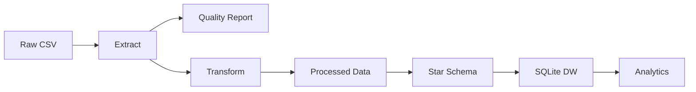

# Arquitectura del proyecto

## Objetivo
Construir un pipeline ETL reproducible y modular sobre un dataset de operaciones de delivery, con data warehouse local en SQLite y soporte de analitica.

## Capas de datos
- data/raw: dataset original, inmutable.
- data/staging: datos parcialmente limpios y reportes intermedios.
- data/processed: datos transformados y listos para DW.
- data/warehouse: base SQLite con modelo estrella.

## Flujo ETL

## Componentes
- src/extract.py: lectura robusta (encoding, chunking) y profiling inicial.
- src/quality.py: reporte de calidad y validaciones.
- src/transform.py: limpieza, imputaciones, feature engineering y outliers.
- src/load.py: construccion de star schema y carga a SQLite con indices.
- src/logger.py: logging centralizado.
- src/utils.py: utilidades comunes (timer, memoria, normalizacion).
- main.py: orquestacion end-to-end.

## Decisiones tecnicas
- Idempotencia: cargas reemplazan tablas en SQLite.
- Modularidad: cada fase es un modulo independiente.
- Escalabilidad: chunking automatico si el archivo supera el umbral.
- Observabilidad: logs de tiempos y metricas de calidad.

## Optimizaciones aplicadas
- Downcast de tipos numericos y conversion a category cuando aplica.
- Imputacion controlada de nulos.
- Capping de outliers con IQR.
- Indices en claves foraneas del DW.
