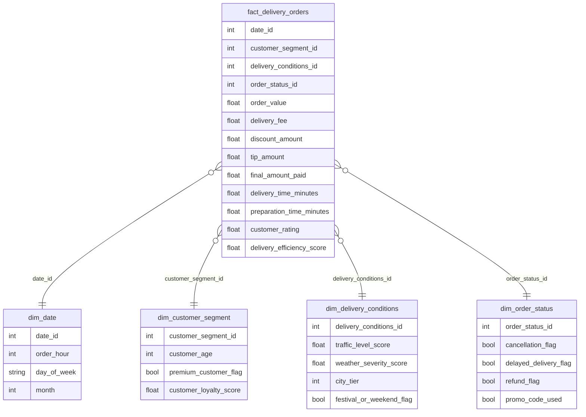

# Star Schema

## Descripcion
El Data Warehouse se organiza en un esquema estrella con una tabla de hechos y cuatro dimensiones. Se priorizan claves surrogate e indices para consultas analiticas.

## Diagrama

## Tabla de hechos
- fact_delivery_orders: metricas de valor, tiempos y calidad de servicio, mas claves foraneas a dimensiones.

## Dimensiones
- dim_date: hora, dia de semana y mes.
- dim_customer_segment: edad, premium y score de fidelidad.
- dim_delivery_conditions: trafico, clima, ciudad y contexto.
- dim_order_status: estados de la orden (cancelacion, retraso, reembolso, promo).
